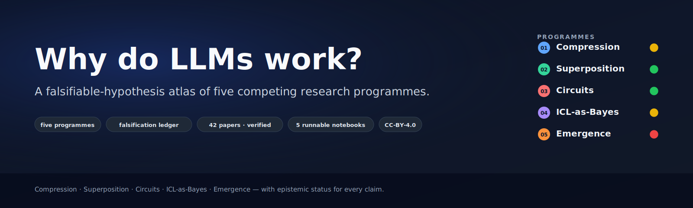
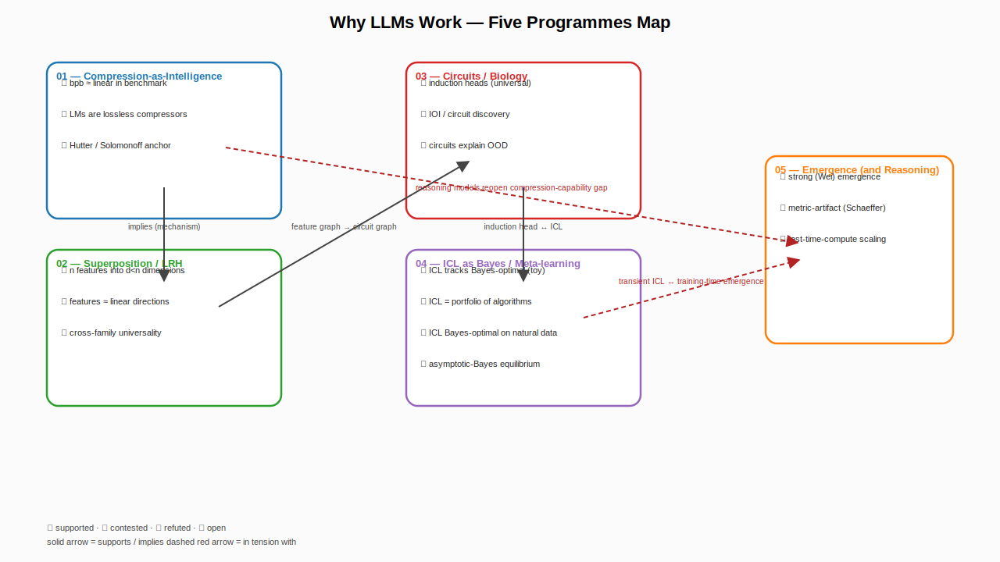

<p align="center">
  
</p>

<h1 align="center">Why Do LLMs Work? — A Falsifiable-Hypothesis Atlas</h1>

<p align="center">
  <em>The five-programmes map: every claim carries an epistemic status, every status change requires a cited paper.</em>
</p>

<p align="center">
  <a href="https://bettyguo.github.io/awesome-why-llms-work/"><strong>🌐 Live site</strong></a>
  &nbsp;·&nbsp;
  <a href="https://bettyguo.github.io/awesome-why-llms-work/ledger.html"><strong>📊 Interactive ledger</strong></a>
  &nbsp;·&nbsp;
  <a href="https://bettyguo.github.io/awesome-why-llms-work/superposition-demo.html"><strong>🧪 Run the demo</strong></a>
  &nbsp;·&nbsp;
  <a href="notebooks/"><strong>📓 Notebooks</strong></a>
</p>

<p align="center">
  <a href="LICENSE-content"></a>
  <a href="LICENSE-code"></a>
  <a href=".github/workflows/link-check.yml"></a>
  <a href=".github/workflows/citation-verify.yml"></a>
  
  
  
</p>

---

## Why this repo exists (and how it differs from other awesome-lists)

The existing `awesome-*` lists in interpretability and LLM theory are **flat directories of papers**. They link to good work, but they do not tell you *which claims are alive, which are dead, and which are still being fought over*. They treat the field as a settled science rather than as a young one with sharply contested foundations.

This repo treats "why do LLMs work?" as **five competing research programmes** in the Lakatosian sense. Each programme has a *hard core* (a falsifiable central claim), a *protective belt* (auxiliary hypotheses that absorb local refutations), a *positive heuristic* (the kind of research it generates), and an *evidence ledger* (what the literature says about it right now).

For every claim we track, we record an **epistemic status** — 🟢 supported, 🟡 contested, 🔴 refuted, ⚪ open — and a **falsifier** — the kind of evidence that would change the status. Status changes are themselves pull requests: see [CONTRIBUTING.md](CONTRIBUTING.md).

If you want a flat bibliography, see the [companion repos](#related-and-companion-repos) we link to. If you want a map of *what we actually believe, why, and how confidently*, you are in the right place.

---

## 🌐 The live site

A polished, interactive GitHub Pages companion lives at **<https://bettyguo.github.io/awesome-why-llms-work/>**. It pulls structured data straight from the per-programme files in this repo and presents:

| Page | What you get |
|------|-------------|
| **[Landing](https://bettyguo.github.io/awesome-why-llms-work/)** | Hero, five programme cards, live status snapshot, embedded taxonomy diagram. |
| **[Interactive ledger](https://bettyguo.github.io/awesome-why-llms-work/ledger.html)** | All 41 tracked claims, filterable by programme and status, full-text searchable, row-expand to see supporting / refuting citations. |
| **[Superposition demo](https://bettyguo.github.io/awesome-why-llms-work/superposition-demo.html)** | Trains a 2-layer model on sparse synthetic features **in your browser** and shows the encoder columns arranging into regular-polygon configurations (digon → triangle → pentagon → hexagon) as you slide sparsity. The Elhage-et-al-2022 toy model, no install. |

Source: [`docs/`](docs/) (vanilla HTML/CSS/JS + Tailwind via CDN, no build step). Deploy is wired up in [`.github/workflows/pages.yml`](.github/workflows/pages.yml).

---

## Table of contents

- [The Question](#the-question)
- [The Five Programmes — at a glance](#the-five-programmes--at-a-glance)
- [The taxonomy diagram](#the-taxonomy-diagram)
- [Reading paths](#reading-paths)
- [Notebooks (run in <5 min on a free Colab T4)](#notebooks-run-in-5-min-on-a-free-colab-t4)
- [Synthesis essays](#synthesis-essays)
- [Papers index (flat)](#papers-index-flat)
- [Falsification ledger summary](#falsification-ledger-summary)
- [What's new](#whats-new)
- [Adjacent programmes](#adjacent-programmes)
- [Glossary](#glossary)
- [Tools](#tools)
- [FAQ](#faq)
- [Contributing](#contributing)
- [Citation](#citation)
- [Related and companion repos](#related-and-companion-repos)
- [Acknowledgements](#acknowledgements)

---

## The Question

**Why do large language models work?** is not a single question. It splits into at least four:

1. *Why does next-token prediction at scale produce broadly intelligent behavior at all?* — a question about objectives.
2. *What kinds of representations and algorithms do trained transformers actually use?* — a question about internals.
3. *Why does in-context learning happen, and what is it computationally?* — a question about inference-time behavior.
4. *Why do capabilities appear sharply at certain scales, and what does "appear" even mean?* — a question about scaling phenomena.

No single research programme answers all four. The most influential ones each *prioritize* one or two of these questions and treat the others as derivative. The programmes are in tension: some are theoretical and some are empirical; some predict smooth scaling and some predict discontinuities; some treat ICL as Bayesian inference and some treat it as a discoverable circuit.

A **programme map** is the right shape for the answer because the field is genuinely contested. Pretending otherwise produces either survey papers that are too cautious to make claims, or hype that is too credulous to survive a quarter. This repo aims to sit between the two: take strong positions, mark their status, and update on evidence.

---

## The Five Programmes — at a glance

| # | Programme | Hard core (falsifiable claim) | Key proponents | Current status | If you read one paper |
|---|-----------|-------------------------------|----------------|----------------|------------------------|
| [01](programmes/01-compression-as-intelligence.md) | **Compression-as-Intelligence** | A model's average lossless compression ratio over text predicts its average benchmark performance linearly across model families and scales. | Hutter; Delétang et al.; Huang et al. | 🟡 Contested — strong empirical correlation, debated causation. | [Huang et al. 2024, *Compression Represents Intelligence Linearly*](https://arxiv.org/abs/2404.09937) |
| [02](programmes/02-superposition-linear-rep.md) | **Superposition & Linear Representations** | Trained models store more features than they have dimensions for, and those features are recoverable as approximately linear directions in activation space. | Elhage et al.; Olah; Park, Choe, Veitch; Cunningham et al.; Bricken et al. | 🟢 Supported (existence) / 🟡 Contested (universality) | [Elhage et al. 2022, *Toy Models of Superposition*](https://transformer-circuits.pub/2022/toy_model/index.html) |
| [03](programmes/03-circuits-and-biology.md) | **Circuits and the Biology of LLMs** | Trained transformers contain discoverable, reusable, and largely modular sub-graphs ("circuits") that implement specific behaviors and that can be causally validated by ablation. | Olah; Olsson et al.; Wang et al.; Conmy et al.; Anthropic interpretability team | 🟢 Supported (for narrow tasks) / 🟡 Contested (for general behavior) | [Olsson et al. 2022, *In-context Learning and Induction Heads*](https://arxiv.org/abs/2209.11895) |
| [04](programmes/04-icl-as-bayes-meta-learning.md) | **In-Context Learning as Implicit Bayes / Meta-Learning** | Trained transformers implement an algorithm that is close to Bayesian posterior inference over a distribution of latent tasks, and ICL behavior tracks the Bayes-optimal predictor under that distribution. | Xie et al.; von Oswald et al.; Akyürek et al.; Bai et al. | 🟡 Contested — strong in toy settings, weakening on natural data. | [Xie et al. 2022, *An Explanation of ICL as Implicit Bayesian Inference*](https://arxiv.org/abs/2111.02080) |
| [05](programmes/05-emergence-and-reasoning.md) | **Emergence and Its Discontents (and Reasoning)** | Some capabilities are *genuinely* emergent — they cannot be predicted from smaller-model behavior under any continuous metric. (Schaeffer et al. argue: no, the apparent discontinuity is a metric artifact.) | Wei et al. (pro); Schaeffer et al. (con); test-time-compute work (Snell et al.) | 🔴 Refuted in its strong form / 🟡 Contested in weaker forms | [Schaeffer, Miranda, Koyejo 2023, *Are Emergent Abilities a Mirage?*](https://arxiv.org/abs/2304.15004) |

> Status conventions: 🟢 supported (≥2 independent replications or original + survey) · 🟡 contested (named credentialed critics with cited papers) · 🔴 refuted (cited refuting paper accepted by the community) · ⚪ open (no consensus yet). See [programmes/README.md](programmes/README.md) for the full taxonomy.

---

## The taxonomy diagram



Source: [`scripts/render_taxonomy.py`](scripts/render_taxonomy.py). Regenerate with `python scripts/render_taxonomy.py`. PNG twin at [`taxonomy.png`](taxonomy.png) for social previews.

---

## Reading paths

The same material, four entry points:

- **[30 minutes](reading-paths/30-minute-overview.md)** — read the executive summary and skim the five tables. Leave with a working mental model.
- **[One weekend](reading-paths/one-weekend-intro.md)** — one programme per session; run the notebook; read the "if you read one paper" link.
- **[One month deep dive](reading-paths/one-month-deep-dive.md)** — all five programmes + three synthesis essays + the adjacent appendix.
- **[Research track](reading-paths/research-track.md)** — open problems, falsification targets, and a starter project for each programme. Aimed at PhD students and ML researchers.

---

## Notebooks (run in <5 min on a free Colab T4)

Each notebook is a teaching artifact: it states a falsifiable claim in the title, then either supports or refutes it on a small scale you can replicate. See [`notebooks/README.md`](notebooks/README.md) for the runtime / GPU table.

| # | Programme | Notebook | Claim demonstrated | Colab |
|---|-----------|----------|--------------------|-------|
| 01 | Compression | [`01-compression-ratio-vs-benchmark.ipynb`](notebooks/01-compression-ratio-vs-benchmark.ipynb) | Bits-per-byte on a fixed corpus correlates with MMLU score across a small sample of open models. | [Open](https://colab.research.google.com/github/bettyguo/awesome-why-llms-work/blob/main/notebooks/01-compression-ratio-vs-benchmark.ipynb) |
| 02 | Superposition | [`02-toy-superposition.ipynb`](notebooks/02-toy-superposition.ipynb) | A 2-layer model with a bottleneck packs more sparse features than it has dimensions, recoverable as linear directions. | [Open](https://colab.research.google.com/github/bettyguo/awesome-why-llms-work/blob/main/notebooks/02-toy-superposition.ipynb) |
| 03 | Circuits | [`03-induction-head-discovery.ipynb`](notebooks/03-induction-head-discovery.ipynb) | A small transformer trained on a copy task develops an attention pattern with the induction-head signature. | [Open](https://colab.research.google.com/github/bettyguo/awesome-why-llms-work/blob/main/notebooks/03-induction-head-discovery.ipynb) |
| 04 | ICL-as-Bayes | [`04-icl-as-bayes-hmm-mixture.ipynb`](notebooks/04-icl-as-bayes-hmm-mixture.ipynb) | On a synthetic mixture-of-HMMs, in-context predictions track the Bayes-optimal posterior as context length grows. | [Open](https://colab.research.google.com/github/bettyguo/awesome-why-llms-work/blob/main/notebooks/04-icl-as-bayes-hmm-mixture.ipynb) |
| 05 | Emergence | [`05-emergence-mirage-demo.ipynb`](notebooks/05-emergence-mirage-demo.ipynb) | The same model family looks "emergent" under exact-match accuracy and "smooth" under token-edit-distance. | [Open](https://colab.research.google.com/github/bettyguo/awesome-why-llms-work/blob/main/notebooks/05-emergence-mirage-demo.ipynb) |

Each notebook also says explicitly **what it does not show** — the failure mode of mini-experiments is overgeneralization, and we want to be loud about it.

---

## Synthesis essays

Programmes interact. The synthesis essays argue for specific relationships between them and propose tests:

- **[Compression ⇔ Superposition](essays/compression-and-superposition.md)** — if compression-is-intelligence is right and if superposition is the mechanism the model uses to compress, the two programmes are aspects of one phenomenon. What would falsify that?
- **[Circuits ⇔ ICL-as-Bayes](essays/circuits-and-icl-bayes.md)** — Bayesian and circuit-level explanations of ICL look incompatible at first glance. They are not; we argue they are the same explanation at different levels of abstraction, and we identify the specific places they make different predictions.
- **[Emergence ⇔ Reasoning models](essays/emergence-vs-reasoning-models.md)** — what test-time-compute scaling (o1, R1, s1) does and does not tell us about emergence.
- **[SLT ⇔ Grokking](essays/slt-and-grokking.md)** — Singular Learning Theory predicts phase transitions; mechanistic interpretability tells us what each phase computes; the bridge is the same picture at three levels. Three predictions, one of which would promote SLT from adjacent to core programme.
- **[Codebook vs. Continuous](essays/codebook-vs-continuous.md)** — are linear-direction features the *unique* useful description? Tamkin et al.'s discrete-codebook alternative is a serious challenge; we propose the single experiment that would settle it.
- **[How to falsify an LLM theory](essays/how-to-falsify-an-llm-theory.md)** — methodological essay; addresses the strongest critiques of this repo and of the programme-map approach.

---

## Papers index (flat)

If you came here asking "does this repo cite paper X?", the answer is in [`PAPERS.md`](PAPERS.md) — a generated flat table of every arXiv-cited paper, its programme assignment(s), and the files that cite it. 42 unique papers at the time of writing. Auto-regenerated from the per-programme files by [`scripts/generate_papers_index.py`](scripts/generate_papers_index.py); do not edit by hand.

For *opinionated* navigation, use the programme files; the index is the orthogonal "is X cited?" lookup.

---

## Falsification ledger summary

A rolled-up count of claim statuses across the repo. Regenerate via `python scripts/render_ledger.py --write-readme`.

<!-- LEDGER:START -->
| Programme | 🟢 Supported | 🟡 Contested | 🔴 Refuted | ⚪ Open | Total |
|-----------|---------------|---------------|---------------|---------------|-------|
| 01 Compression | 3 | 2 | 0 | 2 | 7 |
| 02 Superposition / LRH | 5 | 3 | 0 | 2 | 10 |
| 03 Circuits | 5 | 3 | 0 | 2 | 10 |
| 04 ICL-as-Bayes | 5 | 2 | 2 | 0 | 9 |
| 05 Emergence | 3 | 1 | 1 | 1 | 6 |
| **Total** | **21** | **11** | **3** | **7** | **42** |
<!-- LEDGER:END -->

For the per-claim breakdown, see [`tracker/falsification-events.md`](tracker/falsification-events.md).

---

## What's new

Top 5 most recent ingested items live in [`tracker/`](tracker/). New items are proposed by [`scripts/ingest_arxiv.py`](scripts/ingest_arxiv.py) (which opens a draft PR — never an auto-merge) and reviewed by maintainers under the [paper-suggestion template](.github/ISSUE_TEMPLATE/paper-suggestion.md).

We publish a monthly digest at the start of each month. See [`tracker/monthly-digest-2026-05.md`](tracker/monthly-digest-2026-05.md) for the current one.

---

## Adjacent programmes

Not every theory of why LLMs work fits neatly into the five programmes above. Some are too young to have an evidence ledger; some overlap heavily with an existing programme. We track them in [`programmes/adjacent-programmes.md`](programmes/adjacent-programmes.md):

- **Singular Learning Theory** (Watanabe; the alignment-community SLT writeups).
- **The Platonic Representation Hypothesis** ([Huh et al. 2024](https://arxiv.org/abs/2405.07987)).
- **Predictive Processing / Free Energy analogues**.
- **Grokking & phase transitions** as a candidate sub-programme of Emergence.

If you think one of these deserves its own programme, open a [`new-programme.md`](.github/ISSUE_TEMPLATE/new-programme.md) issue.

---

## Glossary

See [`GLOSSARY.md`](GLOSSARY.md). 60+ terms, each with a one-paragraph definition and a "see also" link. Recommended starting points if you are new: *induction head, superposition, polysemanticity, sparse autoencoder, linear representation, in-context learning, scaling law, grokking, circuit, ablation, activation patching, logit lens*.

---

## Tools

See [`TOOLS.md`](TOOLS.md). An opinionated index of the libraries and services this repo's programmes are *load-bearing* on — TransformerLens, SAELens, nnsight, Pyvene, Neuronpedia, Goodfire Ember, ACDC / EAP, circuit-tracer. We deliberately stop at "load-bearing"; for exhaustive tool directories, see the [related repos](#related-and-companion-repos).

---

## FAQ

See [`FAQ.md`](FAQ.md) for the questions we get most. Highlights: *why five programmes*, *isn't your taxonomy itself contested*, *how do I disagree with a status verdict*, *why isn't scaling-laws a programme*, *is this safety / alignment commentary* (no).

---

## Contributing

We accept PRs. The contribution schema is strict on purpose — see [`CONTRIBUTING.md`](CONTRIBUTING.md). In short:

- Every paper added must carry an **epistemic status**, a **programme assignment**, a **falsification implication**, and a **≤ 80-word annotation that reflects actual reading, not abstract paraphrase**.
- Status changes are PRs of their own ([template](.github/ISSUE_TEMPLATE/status-change.md)). A 🟢 → 🔴 move requires a cited refuting paper, not a vibe.
- All citations are verified by `scripts/verify_citations.py` in CI; unverifiable citations are rejected automatically.
- We have a [Code of Conduct](CODE_OF_CONDUCT.md). It is short and not a joke.

---

## Citation

If this repo helped a paper or talk, please cite it:

```bibtex
@misc{awesome-why-llms-work,
  title  = {Why Do LLMs Work? A Falsifiable-Hypothesis Atlas},
  author = {Donxin Guo},
  year   = {2026},
  url    = {https://github.com/bettyguo/awesome-why-llms-work},
  note   = {CC-BY-4.0 content; MIT code}
}
```

---

## Related and companion repos

The following are *good* and we link rather than duplicate. If your question is "what papers exist?" rather than "what should I believe?", any of them is a fine starting point. We audit them in [`_internal/competitor_audit.md`](_internal/competitor_audit.md).

- [`JShollaj/awesome-llm-interpretability`](https://github.com/JShollaj/awesome-llm-interpretability) — broad tool + paper directory.
- [`ruizheliUOA/Awesome-Interpretability-in-Large-Language-Models`](https://github.com/ruizheliUOA/Awesome-Interpretability-in-Large-Language-Models) — large bibliography organized by sub-area (SAEs in particular).
- [`cooperleong00/Awesome-LLM-Interpretability`](https://github.com/cooperleong00/Awesome-LLM-Interpretability) — topic-indexed bibliography with stars on influential entries.
- [`Dakingrai/awesome-mechanistic-interpretability-lm-papers`](https://github.com/Dakingrai/awesome-mechanistic-interpretability-lm-papers) — survey-driven taxonomy with TL;DR annotations.

We thank the maintainers of these lists; this repo would have been harder to write without them.

---

## Acknowledgements

The framing of this repo owes obvious debts to Imre Lakatos (research programmes), Karl Popper (falsifiability), and the long line of mechanistic-interpretability researchers — Chris Olah, Neel Nanda, Catherine Olsson, the Anthropic interpretability team, EleutherAI, MATS — who treated "what is the model actually doing?" as a serious empirical question well before the rest of the field caught up. Errors are entirely ours.
